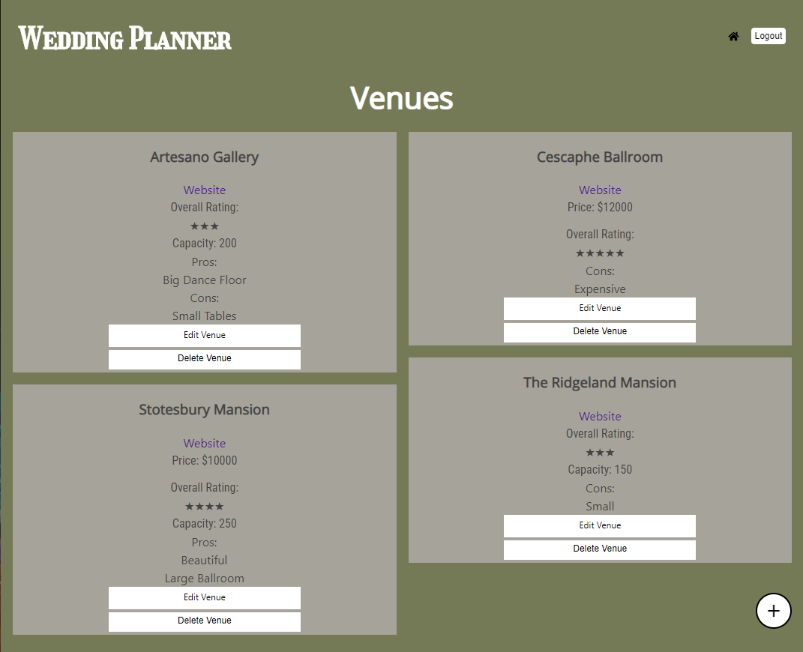

## Wedding Planner

Here is the link to the [live app](https://kclynch94-wedding-planner.now.sh/).

## Summary

This app is designed to help people plan there weddings. With tons of options out there for each piece of a wedding it be hard to pick the right one and even keep track of all the options. Wedding planner allows you to log your favorites and compare them.

## API Endpoints

The base URL of the API is https://aqueous-peak-74784.herokuapp.com/api

This API is authenticated so only users with a valid API token will be able to access it.

This API has endpoints for the following:

* /venues
* /photographers
* /guests
* /caterers
* /florists

All of the endpoints have CRUD operations

Pros and Cons each have their own table in the database

### Venues
* id
* venue_name
* venue_website
* venue_price
* venue_rating
* venue_capacity
* user_id

### Pros
* id
* pro_content
* pro_type
* ref_id
* user_id

### Cons
* id
* con_content
* con_type
* ref_id
* user_id

### Caterers
* id
* caterer_name
* caterer_website
* caterer_price
* caterer_rating
* caterer_type
* user_id

### Florists
* id
* florist_name
* florist_website
* florist_price
* florist_rating
* user_id

### Guests
* id
* guest_first_name
* guest_last_name
* guest_type
* guest_plus_one
* guest_address
* user_id